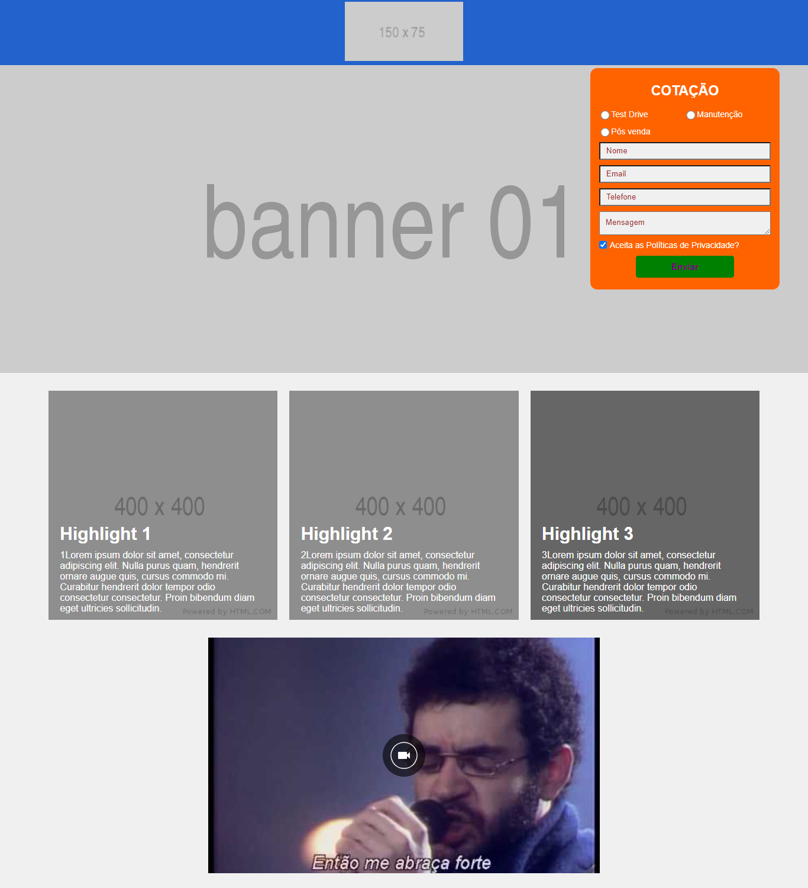

## Pré-requisitos

- 1° [Node](https://nodejs.org/en/)

```bash
sudo apt install nodejs 
```

- 2° [Npm](https://www.npmjs.com/)

```bash
sudo apt install npm
```

- 3° [Gulp](https://gulpjs.com/)

```bash
npm install gulp-cli -g
```

- 4° [GIT](https://git-scm.com/)

```bash
sudo apt-get install git
```

- 5° [Yarn](https://yarnpkg.com/en/)

```bash
sudo apt install yarn
```

## Plataforma

- Para conseguir executar o projeto rode o comando yarn para instalar as dependecias.

```bash
yarn install
```

## Projeto

Para inicializar um projeto, deve rodar o comando abaixo

```bash
gulp --theme "nome_do_template":
```

  O comando 'gulp' limpa todo o html e css antigos contidos na pasta dist, apos cria novos arquivos html, css, imagens e abre o server aplicação. 

 ## Arquivos

 voce recebera os seguintes  arquivos, index.html , main.scss , _variables.scss , index.json, utilizeos para realização do desafio. 

 # AMP Templates

Olá aqui se encontra o teste amp abaixo encontrara diversas tarefas para realizar e o passo a passo para consumir
 arquivos e automatizar o seu tempo como programador.

desafio
recrie a pagina a seguir utilizando elementos amp como amp-img , amp-youtube , amp-carousel, além disto utilize o sass
 e o padrão de projeto BEM para realizar a estilização da pagina e por ultimo mas não menos importante consuma as informações do arquivo json com twig também disponibilizado sinta-se a vontade para criar mais variáveis no arquivo para melhor desempenho da aplicação . 

 Para automatizar a criação e otimizar o código utilize o twig para fazer loops e criar os blocos do como o de destaque e os campos do formulário.



